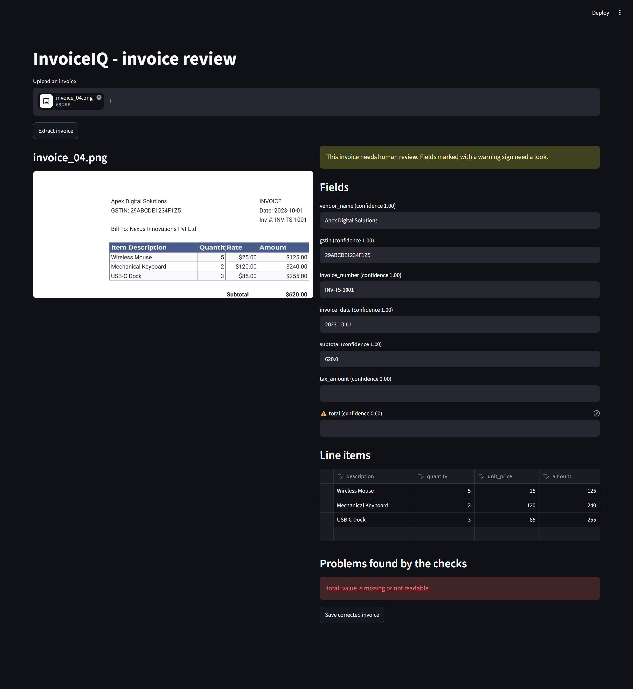
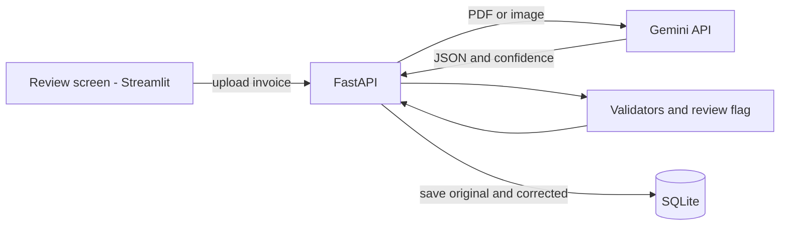

# InvoiceIQ

AI-powered invoice extraction with a human-review safety net. Upload an invoice (PDF, PNG or JPG) and get structured JSON back, with a confidence score for every field and a clear flag when a person should double-check it.



## What it does
- Reads invoices with a vision-capable AI model (Google Gemini) and returns clean JSON
- Returns `null` for anything missing or cut off, instead of guessing
- Checks the AI's answer with plain code (maths, GSTIN, tax rate, date, missing fields)
- Combines those checks with the AI's own confidence scores to set `needs_review`
- Lets a person correct the flagged fields in a review screen and saves both the AI's answer and the corrected version

## How it works


## Why the AI is not trusted blindly
The AI can misread an invoice or invent values for parts it cannot see. So every answer is checked:

| Check | What it catches |
|---|---|
| Line maths | quantity x unit price does not equal the line amount |
| Subtotal and total | line amounts do not add up to the subtotal, or subtotal + tax does not equal the total |
| GSTIN format | the GST number is not 15 characters in the right shape |
| Tax rate | the tax is not a standard GST percentage of the subtotal |
| Date | the date is incomplete, invalid or in the future |
| Missing fields | a required value is empty |
| AI confidence | the model itself says it is unsure (below 0.8) |

Rules and confidence catch different mistakes. For example, a rule catches the half-visible date `2023-1`, while low confidence catches a cut-off invoice number that looks valid.

## API
| Endpoint | Purpose |
|---|---|
| `GET /health` | Is the service running? |
| `POST /extract` | Upload an invoice, get the reviewed result |
| `POST /invoices` | Save an original and a corrected invoice |
| `GET /invoices` | List saved invoices |

Shortened example response from `POST /extract` for a cut-off invoice:
```json
{
  "invoice": {
    "vendor_name": "Apex Digital Solutions",
    "invoice_number": "INV-TS-1001",
    "subtotal": 620.0,
    "tax_amount": null,
    "total": null
  },
  "problems": [{"field": "total", "message": "value is missing or not readable"}],
  "low_confidence_fields": [],
  "needs_review": true
}
```

## Run locally
```bash
python -m venv .venv
.\.venv\Scripts\Activate.ps1
pip install -r requirements.txt
uvicorn app.main:app --reload
```
Create a `.env` file containing `GEMINI_API_KEY=your_key_here`, then open http://127.0.0.1:8000/docs

Review screen (in a second terminal):
```bash
pip install -r requirements-ui.txt
streamlit run ui/review_app.py
```

## Run with Docker
```bash
docker build -t invoiceiq-api .
docker run --rm -p 8000:8000 --env-file .env invoiceiq-api
```

## Run the tests
```bash
pip install -r requirements-dev.txt
pytest
```
The tests use a fake AI, so they need no API key and no internet.

## Project structure
```
app/        API, AI extraction, validators, review logic, storage
ui/         Streamlit review screen
tests/      Unit and API tests
samples/    Fake invoices for testing
```

## Roadmap
- Background job queue and PostgreSQL
- Accuracy benchmark on a labelled set of invoices
- Automated tests and image builds with GitHub Actions
- Public deployment

All sample invoices are fake.