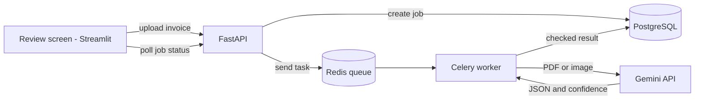
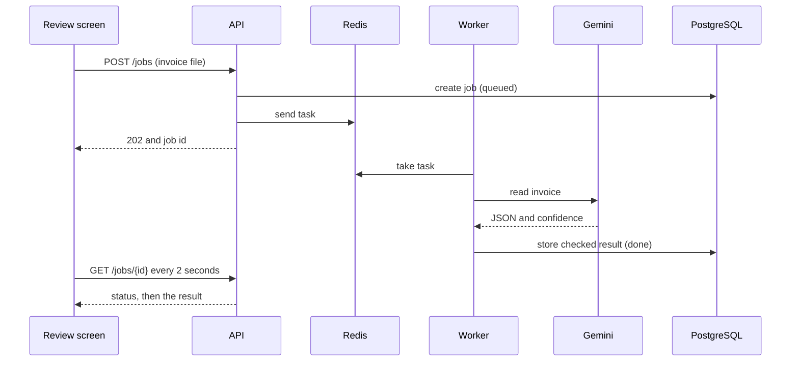
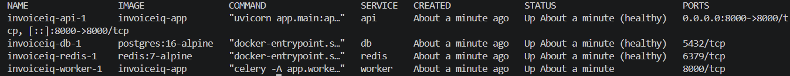

# InvoiceIQ

AI-powered invoice extraction with a human-review safety net. Upload an invoice (PDF, PNG or JPG) and get structured JSON back, with a confidence score for every field and a clear flag when a person should double-check it. Invoices are processed in the background by a worker, so uploads never make the user wait.


## What it does
- Reads invoices with a vision-capable AI model (Google Gemini) and returns clean JSON
- Returns `null` for anything missing or cut off, instead of guessing
- Checks the AI's answer with plain code (maths, GSTIN, tax rate, date, missing fields)
- Combines those checks with the AI's confidence scores to set `needs_review`
- Processes uploads as background jobs (Redis and Celery), with retries when the AI service is busy
- Lets a person correct flagged fields in a review screen, and stores both the AI's answer and the corrected version in PostgreSQL

## Architecture


How one invoice flows:


## Why the AI is not trusted blindly
The AI can misread an invoice or invent values for parts it cannot see. So every answer is checked:

| Check | What it catches |
|---|---|
| Line maths | quantity x unit price does not equal the line amount |
| Subtotal and total | line amounts do not add up to the subtotal, or subtotal + tax does not equal the total |
| GSTIN format | the GST number is not 15 characters in the right shape |
| Tax rate | the tax is not a standard GST percentage of the subtotal |
| Date | the date is incomplete, invalid or in the future |
| Missing fields | a required value is empty |
| AI confidence | the model itself says it is unsure (below 0.8) |

Rules and confidence catch different mistakes. A rule catches a half-visible date like `2023-1`, while low confidence catches a cut-off invoice number that looks valid.

## Reliability
- **Retries:** a busy or rate-limited AI service is retried up to 3 times with growing waits. Permanent errors (such as a wrong API key) fail immediately.
- **No lost jobs:** tasks wait in Redis, so a job uploaded while the worker is down is processed when it returns.
- **Health checks:** `/health/ready` checks the database and Redis, and Docker uses it to mark the API healthy or unhealthy.
- **Tests:** about 60 automated tests run with a fake AI, so they need no API key and no internet.
- **Smoke test:** `smoke_test.py` checks a running system from end to end.



## API
| Endpoint | Purpose |
|---|---|
| `GET /health` | Is the service running? |
| `GET /health/ready` | Are the database and Redis reachable? |
| `POST /jobs` | Upload an invoice, get a job id (202) |
| `GET /jobs/{id}` | Job status, and the reviewed result when done |
| `GET /jobs` | Recent jobs (optional `status` and `limit`) |
| `POST /extract` | Upload and wait for the result in one call |
| `POST /invoices` | Save an original and a corrected invoice |
| `GET /invoices` | List saved invoices |

## Run with Docker (recommended)
```bash
cp .env.example .env
# edit .env: add your Gemini API key and choose a database password
docker compose up --build
```
The API is at http://localhost:8000/docs. Start the review screen in a second terminal:
```bash
pip install -r requirements-ui.txt
streamlit run ui/review_app.py
```

## Run without Docker
```bash
python -m venv .venv
.\.venv\Scripts\Activate.ps1
pip install -r requirements.txt
uvicorn app.main:app --reload
```
This uses a local SQLite file and runs jobs inside the API, so Redis and the worker are not needed.

## Configuration
| Variable | Used by | Meaning |
|---|---|---|
| `GEMINI_API_KEY` | API, worker | Your Google AI key |
| `POSTGRES_PASSWORD` | database, compose | Local database password |
| `DATABASE_URL` | API, worker | Set by compose. Defaults to a local SQLite file |
| `REDIS_URL` | API, worker | Set by compose |
| `JOB_RUNNER` | API | `celery` (separate worker) or `background` (default) |
| `UPLOAD_DIR` | API, worker | Where uploads wait until processed |
| `API_URL` | review screen | Address of the API |

## Tests
```bash
pip install -r requirements-dev.txt
pytest
python smoke_test.py   # needs the system running; uses the real AI
```

## Project structure
```
app/        API, AI extraction, validators, review logic, jobs, worker, storage
ui/         Streamlit review screen
tests/      Unit and API tests
samples/    Fake invoices for testing
docs/       Screenshots
```

## Status and roadmap
Accuracy has not been measured on a labelled set yet. Next:
- Accuracy benchmark on labelled invoices
- GitHub Actions: automatic tests and image builds
- Public deployment

All sample invoices are fake.